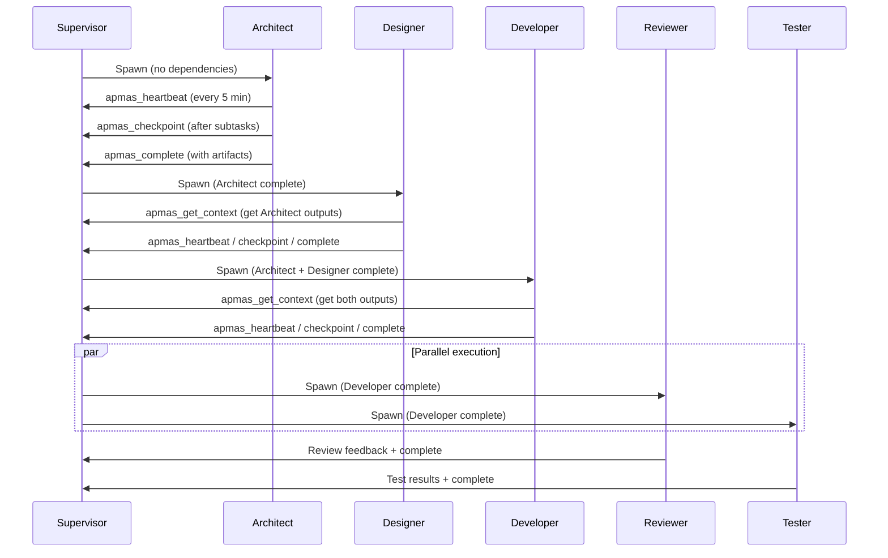

# APMAS Agent Prompts Documentation

This document provides comprehensive documentation of the APMAS agent prompt system, including the architecture, individual agent roles, workflows, and opportunities for enhancement.

---

## Table of Contents

1. [Architecture Overview](#architecture-overview)
2. [Prompt System Design](#prompt-system-design)
3. [Agent Roles](#agent-roles)
   - [Architect](#architect)
   - [Designer](#designer)
   - [Developer](#developer)
   - [Reviewer](#reviewer)
   - [Tester](#tester)
4. [Agent Workflow](#agent-workflow)
5. [MCP Communication Tools](#mcp-communication-tools)
6. [Enhancement Opportunities](#enhancement-opportunities)

---

## Architecture Overview

APMAS (Autonomous Project Management Agent System) orchestrates multiple Claude Code agents through an MCP server. The key architectural insight: **agents cannot self-coordinate reliably** - an external MCP server must manage agent lifecycle, dependencies, and communication.

### Key Components

| Component | File | Responsibility |
|-----------|------|----------------|
| `BaseAgentPrompt` | `Agents/Prompts/BaseAgentPrompt.cs` | Template base class defining prompt structure |
| `PromptFactory` | `Agents/Prompts/PromptFactory.cs` | Resolves and generates prompts by subagent type |
| `AgentRoster` | `Agents/Definitions/AgentRoster.cs` | Validates and manages agent configurations |
| `SupervisorService` | `Core/Services/SupervisorService.cs` | Monitors agents and manages lifecycle |

### Agent Lifecycle States

```
Pending → Queued → Spawning → Running → Completed
                      ↓          ↓
                   Failed     Paused (checkpoint)
                      ↓          ↓
                 Escalated   [restart with context]
```

---

## Prompt System Design

### Base Prompt Template

All agent prompts extend `BaseAgentPrompt`, which provides a consistent structure:

```
# {Role} Agent - APMAS Project

## Your Role
{Role-specific description}

## Working Directory
{Project working directory}

## APMAS Communication
{Standard MCP tool instructions - identical for all agents}

## Your Task
{Role-specific task description}

## Deliverables
{Role-specific deliverables}

## Dependencies
{Role-specific dependencies on other agents}

## Additional Context (optional)
{Checkpoint/recovery context when restarting}
```

### Prompt Generation Flow

1. `SupervisorService` detects a queued agent
2. Calls `IAgentSpawner.SpawnAgentAsync(role, subagentType, checkpointContext)`
3. Spawner uses `IPromptFactory.GeneratePrompt(subagentType, projectState, additionalContext)`
4. Factory looks up the `BaseAgentPrompt` by subagent type
5. Prompt's `Generate()` method builds the complete prompt string
6. Claude Code is spawned with the generated prompt

### Subagent Type Mapping

Each role maps to a Claude Code subagent type:

| Role | Subagent Type | Specialized For |
|------|---------------|-----------------|
| Architect | `systems-architect` | System design, architecture decisions |
| Designer | `design-specialist` | UI/UX, design systems, accessibility |
| Developer | `dotnet-specialist` | .NET implementation, coding |
| Reviewer | `code-reviewer` | Code quality, SOLID principles |
| Tester | `test-writer` | Unit/integration tests, coverage |

---

## Agent Roles

### Architect

**File:** `Agents/Prompts/ArchitectPrompt.cs`
**Subagent Type:** `systems-architect`
**Dependencies:** None (typically the first agent to run)

#### Responsibilities

- Defining system structure and component boundaries
- Making technology stack decisions
- Establishing patterns and conventions
- Creating architectural diagrams and documentation
- Identifying technical risks and mitigation strategies
- Ensuring scalability, maintainability, and security considerations

#### Task Steps

1. Review existing codebase structure (if any)
2. Define component boundaries and responsibilities
3. Specify interfaces between components
4. Document technology choices with rationale
5. Create architecture decision records for key decisions
6. Identify cross-cutting concerns (logging, auth, error handling)

#### Deliverables

- `docs/architecture.md` - Main architecture document
- Component diagrams (as mermaid in markdown)
- Interface specifications
- Technology decision rationale

#### Current Prompt Strengths

- Clear scope for foundational decisions
- Explicit mention of ADRs (Architecture Decision Records)
- Focus on both structure and rationale

#### Enhancement Opportunities

- Add explicit security architecture requirements
- Include performance/scalability targets
- Add API design guidelines
- Request dependency graphs in mermaid format
- Add cloud infrastructure considerations

---

### Designer

**File:** `Agents/Prompts/DesignerPrompt.cs`
**Subagent Type:** `design-specialist`
**Dependencies:** Architect

#### Responsibilities

- Creating UI/UX designs and specifications
- Defining color palettes, typography, and spacing systems
- Establishing design tokens and style guides
- Specifying component visual requirements
- Ensuring accessibility compliance
- Creating consistent design language across the application

#### Task Steps

1. Review architecture documents for component understanding
2. Define design tokens (colors, typography, spacing)
3. Create component specifications with visual requirements
4. Document interaction patterns and states
5. Ensure WCAG accessibility guidelines are addressed
6. Provide style guide documentation

#### Deliverables

- `docs/design-spec.md` - Main design specification
- Design tokens (CSS variables or design system format)
- Component visual specifications
- Style guide documentation

#### Current Prompt Strengths

- Good focus on design tokens and systematic approach
- Explicit accessibility mention (WCAG)
- Clear dependency on Architect

#### Enhancement Opportunities

- Add responsive design breakpoint specifications
- Include dark mode/theming requirements
- Add animation/transition guidelines
- Request component state specifications (hover, active, disabled, loading, error)
- Add iconography guidelines
- Include form validation visual patterns
- Add empty state and error state designs

---

### Developer

**File:** `Agents/Prompts/DeveloperPrompt.cs`
**Subagent Type:** `dotnet-specialist`
**Dependencies:** Architect, Designer

#### Responsibilities

- Implementing features according to specifications
- Following architecture patterns and conventions
- Writing clean, maintainable code
- Implementing proper error handling
- Following security best practices
- Creating code that matches design specifications

#### Task Steps

1. Review architecture document for component structure
2. Review design specifications for UI requirements
3. Implement features following established patterns
4. Ensure proper error handling and logging
5. Write code that is testable and maintainable
6. Follow security best practices (OWASP guidelines)

#### Deliverables

- Source files in `src/` directory
- Properly structured and documented code
- Implementation following architecture patterns
- UI matching design specifications

#### Current Prompt Strengths

- Clear dependency chain (must wait for both Architect and Designer)
- Explicit OWASP security mention
- Focus on testability

#### Enhancement Opportunities

- Add specific code style/linting requirements
- Include logging standards and patterns
- Add configuration management patterns (IOptions<T>)
- Request DI registration patterns
- Add database migration guidelines
- Include API endpoint documentation requirements
- Add feature flag considerations
- Request inline code documentation for complex logic

---

### Reviewer

**File:** `Agents/Prompts/ReviewerPrompt.cs`
**Subagent Type:** `code-reviewer`
**Dependencies:** Developer

#### Responsibilities

- Reviewing code for correctness and quality
- Checking adherence to architecture patterns
- Identifying potential bugs and security issues
- Evaluating code maintainability and readability
- Ensuring SOLID principles are followed
- Providing constructive, actionable feedback

#### Task Steps

1. Review architecture document to understand expected patterns
2. Examine implemented code in `src/` directory
3. Check for adherence to architecture and design specs
4. Identify code smells, bugs, and security vulnerabilities
5. Evaluate error handling and edge cases
6. Provide specific, actionable feedback with file:line references

#### Deliverables

- Code review feedback document
- List of identified issues with severity ratings
- Specific recommendations with file:line references
- Approval status (approved, needs changes, rejected)

#### Current Prompt Strengths

- Emphasis on SOLID principles
- Requirement for file:line references
- Severity ratings for issues
- Clear approval status requirement

#### Enhancement Opportunities

- Add performance review criteria
- Include security checklist (OWASP Top 10)
- Add test coverage evaluation
- Request complexity metrics (cyclomatic complexity)
- Add dependency injection review criteria
- Include async/await pattern review
- Add null safety review
- Request review of exception handling patterns
- Add database query review (N+1, indexing)

---

### Tester

**File:** `Agents/Prompts/TesterPrompt.cs`
**Subagent Type:** `test-writer`
**Dependencies:** Developer

#### Responsibilities

- Writing unit tests for implemented code
- Creating integration tests for component interactions
- Ensuring adequate test coverage
- Writing test fixtures and mocks
- Validating edge cases and error handling
- Running tests and reporting results

#### Task Steps

1. Review implemented code to understand what needs testing
2. Write unit tests for individual components
3. Create integration tests for component interactions
4. Test edge cases and error handling paths
5. Create test fixtures and mock objects as needed
6. Run all tests and ensure they pass

#### Deliverables

- Test files in `tests/` directory
- Unit tests with meaningful assertions
- Integration tests for key workflows
- Test coverage report
- All tests passing

#### Current Prompt Strengths

- Distinction between unit and integration tests
- Edge case and error handling coverage
- Test coverage report requirement

#### Enhancement Opportunities

- Add minimum coverage thresholds
- Include negative test case requirements
- Add performance test considerations
- Request test data builders pattern
- Add database test isolation patterns
- Include API endpoint test patterns
- Add Blazor component test patterns
- Request mutation testing considerations
- Add flaky test detection guidance

---

## Agent Workflow

### Standard Execution Sequence



### Communication Pattern

Agents communicate exclusively through APMAS MCP tools:

1. **Heartbeat** - Signal alive status every 5 minutes
2. **Checkpoint** - Save progress for recovery after subtask completion
3. **Report Status** - Update current status frequently
4. **Get Context** - Retrieve project state and other agents' outputs
5. **Send Message** - Direct communication with other agents
6. **Request Help** - Escalate issues to human or other agents
7. **Complete** - Signal task completion with artifacts

### Timeout and Recovery Strategy

| Attempt | Action |
|---------|--------|
| 1st timeout | Restart with checkpoint context |
| 2nd timeout | Restart with reduced scope |
| 3rd timeout | Escalate to human |

---

## MCP Communication Tools

### apmas_heartbeat

**Purpose:** Signal alive status while working
**Frequency:** Every 5 minutes
**Parameters:**
- `status`: Current status ("working", "blocked", etc.)
- `progress`: Description of current progress

### apmas_checkpoint

**Purpose:** Save progress for recovery
**When:** After completing subtasks
**Parameters:**
- `agentRole`: Role of the calling agent
- `summary`: Summary of current progress
- `completedItems`: Array of completed items
- `pendingItems`: Array of pending items
- `activeFiles`: (optional) Files currently being worked on
- `notes`: (optional) Additional notes for continuation

### apmas_report_status

**Purpose:** Update current status
**When:** Frequently during work
**Parameters:**
- `status`: "working", "blocked", "done", "context_limit"
- `message`: Description of current activity
- `blockedReason`: (optional) Reason for blocking
- `artifacts`: (optional) Completed artifacts

### apmas_get_context

**Purpose:** Retrieve project state and other agents' outputs
**Parameters:**
- `include`: Array of ["project", "agents", "messages", "artifacts"]
- `agentRoles`: (optional) Filter to specific agent roles
- `messageLimit`: (optional) Max messages to return (default: 50)

### apmas_send_message

**Purpose:** Send message to another agent
**Parameters:**
- `from`: Sender agent role
- `to`: Recipient agent role
- `type`: Message type
- `content`: Message content

### apmas_request_help

**Purpose:** Request human or agent assistance
**Parameters:**
- `helpType`: Type of help needed ("clarification", "technical", etc.)
- `issue`: Description of the issue

### apmas_complete

**Purpose:** Signal task completion
**Parameters:**
- `summary`: Summary of completed work
- `artifacts`: Array of created/modified files

---

## Enhancement Opportunities

This section identifies areas where agent prompts can be improved to make agents smarter and more effective.

### 1. Cross-Agent Communication Patterns

**Current State:** Agents know they can use `apmas_send_message` but lack guidance on when/how.

**Enhancement:**
- Add explicit communication protocols
- Define message types and expected responses
- Add collaboration patterns (e.g., Designer can request architecture clarifications)

### 2. Error Recovery Guidance

**Current State:** Agents know to checkpoint but lack sophisticated error handling guidance.

**Enhancement:**
- Add specific error recovery patterns
- Include rollback strategies
- Add partial completion handling
- Define graceful degradation approaches

### 3. Quality Gates

**Current State:** Agents self-determine when they're "done."

**Enhancement:**
- Add explicit quality gates per agent
- Include validation checklists
- Add "definition of done" criteria
- Include peer validation requirements

### 4. Context Window Management

**Current State:** Basic "if you're losing context, checkpoint" guidance.

**Enhancement:**
- Add proactive context management strategies
- Include priority ordering for work items
- Add "smallest completable unit" decomposition guidance
- Include context budget estimation

### 5. Tool-Specific Guidance

**Current State:** Generic task descriptions.

**Enhancement:**
- Add specific tool recommendations per task
- Include file operation patterns
- Add git workflow guidance
- Include specific CLI commands to use

### 6. Output Formatting Standards

**Current State:** Deliverables listed but format not specified.

**Enhancement:**
- Add markdown templates for documents
- Include code documentation standards
- Add diagram format specifications
- Include naming conventions

### 7. Dependency Communication

**Current State:** "Use apmas_get_context to retrieve outputs."

**Enhancement:**
- Add specific fields to look for in dependent outputs
- Include fallback strategies if dependencies incomplete
- Add validation of received context
- Include retry patterns for missing context

### 8. Progress Reporting Granularity

**Current State:** "Report status frequently."

**Enhancement:**
- Define specific status report triggers
- Add progress percentage calculation guidance
- Include estimated remaining work patterns
- Add blocker categorization

### 9. Security-First Patterns

**Current State:** "Follow OWASP guidelines" (generic).

**Enhancement:**
- Add role-specific security concerns
- Include security validation checklists
- Add secrets management patterns
- Include audit logging requirements

### 10. Iterative Refinement Support

**Current State:** Linear workflow (Architect → Designer → Developer → Review/Test).

**Enhancement:**
- Add feedback loop handling
- Include revision patterns
- Add partial rework strategies
- Include incremental improvement patterns

---

## Next Steps for Enhancement

1. **Prioritize Enhancements** - Identify which improvements will have the highest impact
2. **Create Enhancement Templates** - Design template additions for each enhancement area
3. **Implement Incrementally** - Add enhancements one category at a time
4. **Test with Real Projects** - Validate improvements with actual agent runs
5. **Measure Effectiveness** - Track agent success rates and iteration counts

---

## Appendix: Prompt Template Reference

### Complete Prompt Structure (BaseAgentPrompt.Generate)

```csharp
# {Role} Agent - APMAS Project

You are the **{Role}** for the "{project.Name}" project.

## Your Role
{GetRoleDescription()}

## Working Directory
{project.WorkingDirectory}

## APMAS Communication

You have access to APMAS MCP tools for coordination. **USE THEM.**

### Required Tool Usage:

1. **Heartbeat (every 5 minutes)**
   Call `apmas_heartbeat` while working to signal you're alive.

2. **Checkpoint (after each subtask)**
   Call `apmas_checkpoint` to save progress for recovery.

3. **Status Updates (CALL FREQUENTLY)**
   Call `apmas_report_status` whenever you:
   - Start a new task phase
   - Complete a piece of work
   - Hit any delay or blocker
   - Make progress on long work

4. **Completion**
   Call `apmas_complete` when ALL work is done.

### Context Management

If you feel your responses getting shorter or you're losing context:
1. Immediately call `apmas_checkpoint` with your current progress
2. Call `apmas_report_status(status: "context_limit", message: "...")`
3. Stop work - the Supervisor will respawn you with your checkpoint

### Getting Help

If blocked, use `apmas_request_help`.

## Your Task
{GetTaskDescription()}

## Deliverables
{GetDeliverables()}

## Dependencies
{GetDependencies()}

## Additional Context (if provided)
{additionalContext}

---

**BEGIN:** Start your work now. Remember to call `apmas_heartbeat` every 5 minutes.
```
